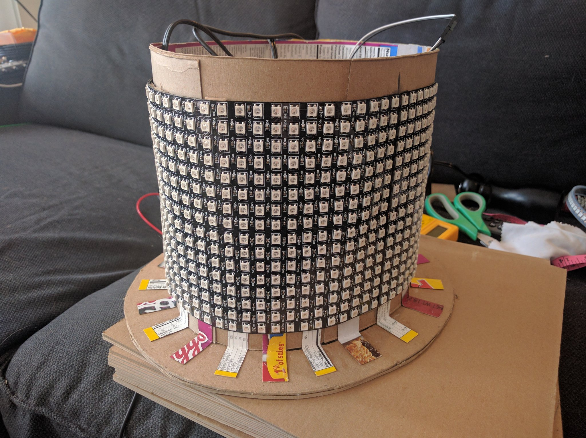
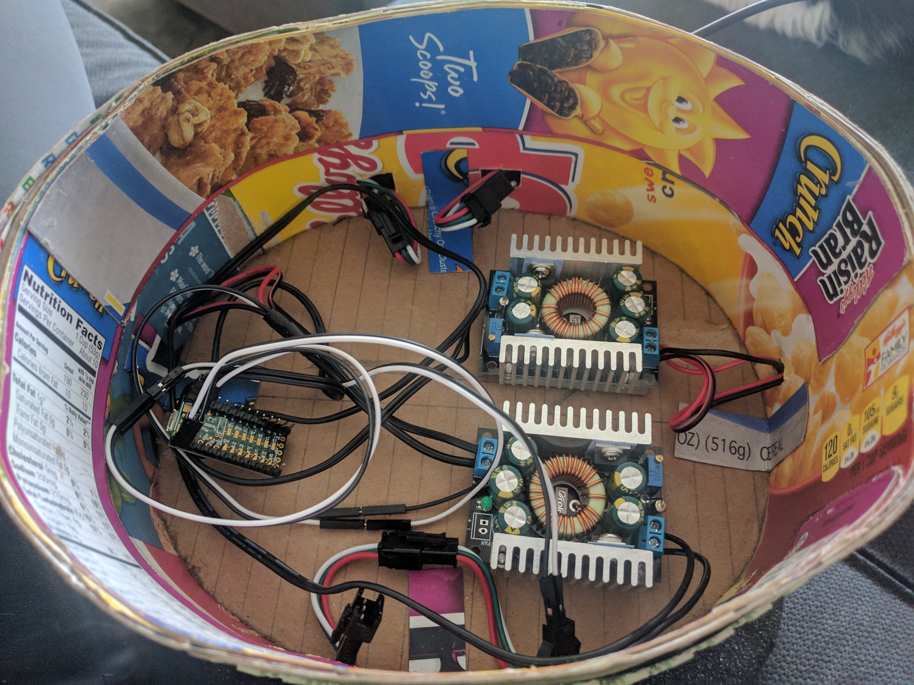
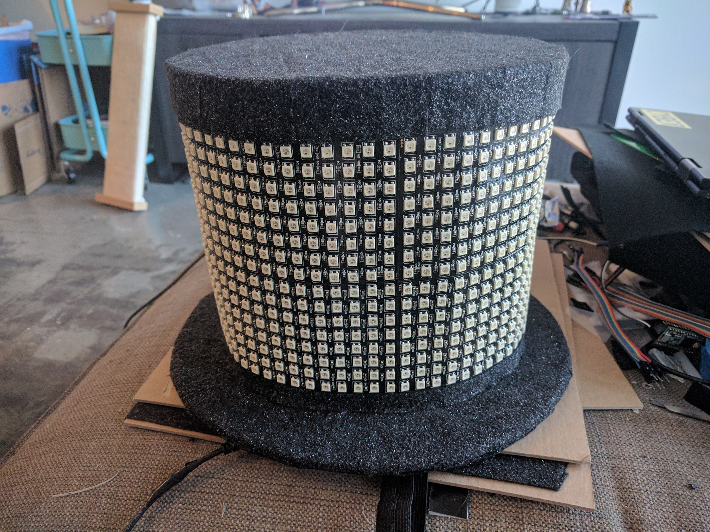

# 1024 LED Top Hat

I made a big shiny top hat with 1024 LEDs and glitter felt. 

## Parts 

- cereal boxes (~3) 
- white glue 
- hot glue 
- [2.5mm chipboard](https://www.amazon.com/Brown-Chipboard-Inches-Caliper-Cardboard/dp/B01E69QMHA/)
- [voltage converter (2x)](https://www.amazon.com/gp/product/B00C4QVTNU/)
- [Teensy 3.2 w/ pin headers](https://www.amazon.com/PJRC-6485230-Teensy-3-2/dp/B015M3K5NG/)
- [8x32 flexible PCB WS2812B LED panel (x4)](https://www.amazon.com/BTF-LIGHTING-0-24ft0-96ft-Flexible-Individually-addressable/dp/B01DC0IPVU/)
- [jumper wires](https://www.amazon.com/Haitronic-Multicolored-Breadboard-Arduino-raspberry/dp/B01LZF1ZSZ/)
- [elastic strap](https://www.amazon.com/gp/product/B00W3G33U8)
- [glitter felt](https://www.amazon.com/gp/product/B00A21T7E2/)
- [mounting tape (3x)](https://www.amazon.com/Gorilla-Tough-Clear-Mounting-Double-Sided/dp/B00OXVG9FW/)
- battery pack (I'm using an XTPower MP-50000, but anything that outputs between 5v-35v at sufficiently high amperage will work)

## Firmware

The firmware is pretty self explanatory, and comes with the two modes: 

- Rainbow bouncing rectangle thing with sparking white LEDs 
- Mario running in circles 

The rainbow mode uses a chain of filled rectangle sprites, and a "sparkle effect" sprite. 

The Mario mode uses a set of sprites to represent each frame in the running animation. 

## Hat Construction 

If you want to build a DIY hat with 1024 LEDs, you probably know how to glue cardboard together. 

So, the hat construction is mostly left as an exercise for the reader, but here is the basic strategy: 

1) Use two layers of chipboard for the brim of the hat. It flexes more in one direction than the other, so offset the layers by 90 degrees. This worked pretty well to make it safe to pick up by any part of the brim. 

2) Make a cylinder out of cereal boxes and glue, with a layer of chipboard about halfway up, inside the cylinder. The chipboard layer will rest against your head on the bottom, and hold the voltage and converters and Teensy on the top.

3) Make a lid that fits the hat, using more cereal boxes and chipboard. 

4) Attach the cylinder to the brim. I used more glue and cereal box cardboard for this. 

5) Use the mounting tape to attach the four LED panels to the outside of the cylinder. I was lucky in that a power of two LEDs fit my head, but you may need to adjust it somewhat. 

6) Wire up the LED panels in series, and route the red and white power wires from the center of each panel into the top compartment of the hat. 

7) Adjust the voltage converters to output 4.0 volts. 

8) Use some more mounting tape to attach the voltage converters to the chipboard layer in the hat, and wire up two LED panels to each converter. 

9) Wire up the Teensy to a voltage converter (VIN/AGND).

10) Wire up a Teensy to the LED panel with an exposed input wire (D1/GND).

11) Attach a piece of the elastic to the underside of the hat. 

12) Cover it in felt, attached with hot glue.

13) Win. 

